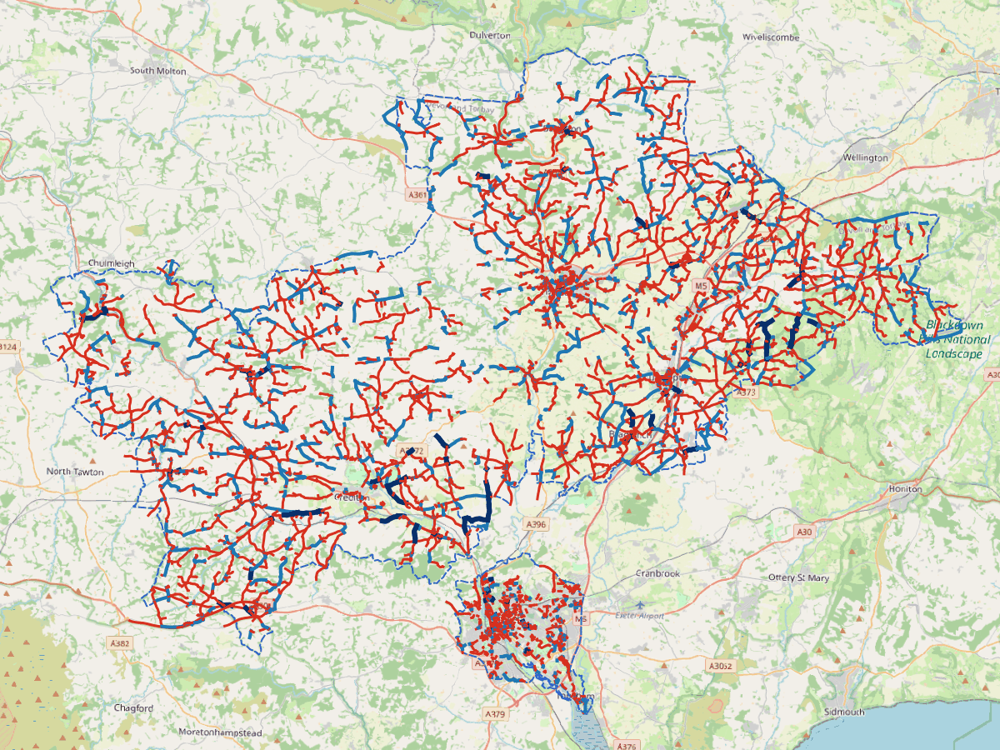
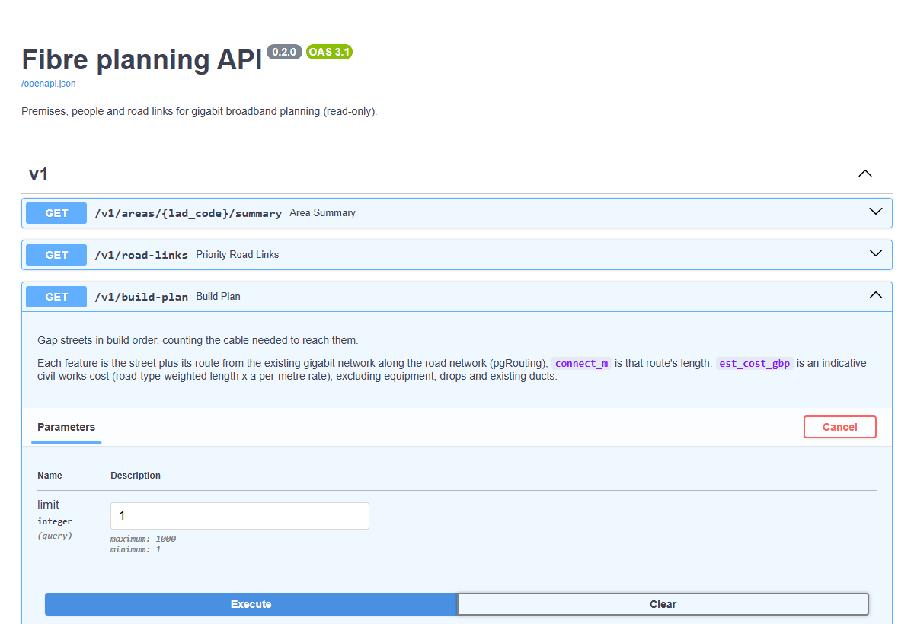

# Fibre planning pipeline: who lacks gigabit broadband, and which roads reach them

A geospatial data platform that turns open data into fibre build plans for
local authorities, kept side by side: here a city (Exeter) and the rural
district next to it (Mid Devon). It combines **population per address** (from the companion
project [GB-Census-Population-Map](https://github.com/petersolan/GB-Census-Population-Map)),
**Ofcom Connected Nations** broadband coverage by postcode and the **OS Open
Roads** network, routes new cable from the existing gigabit network to every
gap street with **pgRouting**, ranks streets by people without gigabit per km
of cable needed, and serves the results through PostGIS, a REST API,
GeoServer and QGIS.


*Exeter in the QGIS project: premises green where their postcode has gigabit,
red where it doesn't; road links from pale to dark red by people without
gigabit per km. GeoServer serves the same layers with the same SLD styles.*

## Results: Exeter and Mid Devon (Ofcom coverage, January 2026)

| | Exeter (city) | Mid Devon (rural) |
|---|---|---|
| Premises (addresses in buildings) | 73,646 | 47,069 |
| Residents | 130,371 | 82,774 |
| Gigabit coverage (UK: 89%) | 86.2% of premises | 64.2% of premises |
| People without gigabit (expected) | ≈ 12,000 | ≈ 26,600 |
| Road links serving them | 722 of 6,402 | 3,433 of 10,668 |
| Median connection from the existing network to a gap street | 0 m (most touch it) | ≈ 1.1 km |
| Proposed new cable (pgRouting) | ≈ 101 km: 89 km along gap streets + 12 km connecting them | ≈ 1,480 km: 1,110 km along gap streets + 371 km connecting them |
| Best 20 streets, including their connections | 2.9 km of cable reaching ≈ 4,300 people | 3.9 km reaching ≈ 1,100 people |
| Indicative civil works for the whole network | ≈ £12.3 m, ≈ £1,360 per premises without gigabit | ≈ £185 m, ≈ £11,700 per premises without gigabit |
| Full pipeline run (24 nodes) | ≈ 20 s | ≈ 16 s |

In Exeter the top-ranked streets are short access roads into dense blocks of
flats and student accommodation: the most people connected per metre of
cable. Mid Devon has twice as many people without gigabit in a third fewer
premises, spread over 913 km² instead of 47 km². 17 of its top 20 streets are
in its towns (Tiverton, Cullompton, Crediton), and its tail shows why rural
build is subsidised: the most expensive gap streets need 6–8 km of new cable to reach
two premises, over £1 m each.



*Both areas in one map: Exeter (bottom centre) and Mid Devon, with gap
streets in red and connecting routes from the existing gigabit network in
blue. Each area is planned separately and kept side by side in PostGIS
([ADR 6](docs/adr/0006-several-areas-side-by-side.md)).*

### Routing new cable

A street's own length isn't the whole cost: cable has to reach it. With no
open data on exchanges or cabinets, new cable starts from the **existing
gigabit network** (road links whose premises all have it). A single
pgRouting Dijkstra run from a virtual super-source joined to that network
finds each gap street's cheapest route along the roads, with digging under A
and B roads weighted as dearer ([ADR 5](docs/adr/0005-routing-from-the-existing-network.md)).

- All 722 gap streets are reachable; 380 already touch the existing network.
- Counting the connection changes the plan: 6 of the top 20 streets drop
  out. Hook Drive, for example, ranks 138th on its own length but needs a
  339 m connection to reach 2 people, and falls to 663rd.


*Proposed cable network (`fibre.build_route`): gap streets in red, connecting
routes from the existing gigabit network in blue (darker where they serve
100+ people). Most connections are short hops at junctions.*

### Indicative cost

Each street's cost is its road-type-weighted route and street length × £100
per metre, Openreach's indicative trenching cost where no duct exists
([ISPreview, 2017](https://www.ispreview.co.uk/index.php/2017/05/new-report-reveals-ways-cut-uk-rollout-cost-full-fibre-broadband.html));
street works are around 70% of fibre build cost. For Exeter's whole proposed
network that is about **£12.3 m, or £1,360 per premises without gigabit**:
above the £300–£400 per premises Openreach quotes for the easiest half of the
UK, and below the ~£4,000 for the final 10%
([ISPreview, 2019](https://www.ispreview.co.uk/index.php/2019/08/openreach-fttp-final-10-of-uk-likely-to-cost-4000-per-premises.html)),
which fits Exeter's remaining gaps being the harder ones. It is civil works
only: no equipment, drops, existing ducts or poles, so use it to compare
options, not as a budget. Mid Devon's whole network comes to about **£185 m,
or £11,700 per premises without gigabit**, nearly nine times Exeter's figure
per premises. The rate is `routing.civils_gbp_per_m` in
`conf/base/parameters.yml`.

## How it works

```
ingest ──► analysis ──► routing ──► publish ──► PostGIS ──► FastAPI ──► QGIS plugin
(Kedro)    (Kedro)      (pgRouting) (Kedro)     (Alembic) ├─► GeoServer (WMS/WFS)
                                                          └─► QGIS project
```

1. **ingest**: the boundary from the ONS API; the area's addresses and
   population from GeoParquet (filtered on read); Ofcom postcode CSVs from
   their zip; OS Open Roads **Shapefiles** read straight from the 606 MB zip
   for the 100 km grid squares the area touches (four for Mid Devon);
   validation that fails fast.
2. **analysis**: each address gets its postcode's chance of having no gigabit
   service ([ADR 4](docs/adr/0004-coverage-per-address-is-a-probability.md));
   addresses snap to their nearest road link (the cable drop, median 16 m),
   skipping motorways, which have no frontage access; links are ranked by
   people without gigabit per km.
3. **routing**: road links become a graph (junctions as vertices, length ×
   road-type cost as weights) loaded into PostGIS; pgRouting finds each gap
   street's route from the existing gigabit network; the union of routes is
   the proposed build network, and streets are re-ranked by people per km of
   total cable.
4. **publish**: replaces the area's rows in PostGIS tables whose schema is
   owned by Alembic ([ADR 2](docs/adr/0002-alembic-owns-the-schema.md)), so
   other areas are untouched; exports a Shapefile and a GeoPackage, and
   records each run with per-node timings.
5. **serve**: a read-only FastAPI service (`/v1/areas` lists the planned
   areas; `/v1/build-plan` returns streets in build order with their routes
   and indicative cost, for one area or all), GeoServer configured through
   its REST API, a QGIS project and a QGIS plugin.

More in [docs/architecture.md](docs/architecture.md), with a diagram.



*The API documents itself (OpenAPI at `/docs`). The QGIS plugin uses the same
endpoints: its build-plan view lists streets with their connection distance and
cost, and zooms to each street and its route.*

## Technology map

| Area | Where |
|---|---|
| Python 3.11, Conda | `environment.yml` (conda-forge), env-pinned PROJ/GDAL paths |
| Data pipeline (Kedro: nodes, datasets, orchestration, reproducibility) | `src/fibre_planning/pipelines/`, `conf/base/catalog.yml`, custom datasets in `src/fibre_planning/datasets/` |
| GeoPandas, GDAL, Shapefiles | `/vsizip/` Shapefile reads, Shapefile + GeoPackage exports (10-character field names handled) |
| PostgreSQL / PostGIS, efficient SQL, indexing | GiST indexes, check constraints, bbox queries that keep the index ([0.74 ms vs 364 ms](docs/performance.md)) |
| Data modelling for several areas | `lad_code` in every composite key, a dataset that replaces one area's rows, per-area runs from one parameter ([ADR 6](docs/adr/0006-several-areas-side-by-side.md)) |
| Network analysis (pgRouting) | `src/fibre_planning/pipelines/routing/`: graph from OS Open Roads junctions, multi-source Dijkstra via a super-source, shortest-path tree as the build network ([a join rewrite took it from 62 s to 0.01 s](docs/performance.md)) |
| SQLAlchemy + Alembic | `src/fibre_planning/db/models.py`, `migrations/`; round-trip and model-drift tests |
| Service and API design | `src/fibre_planning/api/`: versioned `/v1`, Pydantic contracts, OpenAPI at `/docs`, input limits |
| GeoServer | Docker service; `python -m fibre_planning.geoserver` publishes over REST (idempotent); SLD styles |
| QGIS and plugin development | `qgis_project/build_project.py` (PyQGIS), `qgis_plugin/` dock panel (area picker, build plan with routes and cost, road links, postcode lookup) using QGIS's network stack, tested headless |
| Observability | JSON request logs with request IDs, Prometheus `/metrics`, `/health` + `/ready`; Kedro hooks writing `logs/pipeline.jsonl` and run history |
| Testing and quality | pytest (unit + integration on a seeded test database), ruff, mypy, pre-commit |
| CI/CD | `.gitlab-ci.yml` and `.github/workflows/ci.yml`: lint, migrations, tests with PostGIS, image build |
| PowerShell and batch | `scripts/run.ps1` task runner, `run.bat`, `setup_pg_service.ps1`, `package.ps1` |
| Packaging (Artifactory-style) | wheel + QGIS plugin zip, published with twine to a private index (pypiserver in Docker) |
| Security and privacy | read-only role for services, secrets only in `.env`, credential-free QGIS project, localhost-only ports ([ADR 3](docs/adr/0003-least-privilege-and-secrets.md)) |
| Documentation | [architecture](docs/architecture.md), [ADRs](docs/adr/), [runbook](docs/runbook.md), [performance notes](docs/performance.md) |

## Quick start (Windows)

```powershell
.\run.bat setup      # .env with random passwords, conda env, pg_service entry
.\run.bat all        # start containers, migrate, run pipeline, publish, test
.\run.bat pipeline -Area E07000042   # plan Mid Devon too
.\run.bat status     # container health and latest runs
```

Or step by step with the `fibre` environment active:

```powershell
docker compose up -d --build         # PostGIS :5433, API :8000, GeoServer :8080
alembic upgrade head
kedro run                                   # Exeter (default)
kedro run --params area.lad_code=E07000042  # Mid Devon, kept alongside
python -m fibre_planning.geoserver
pytest
```

- API docs: http://127.0.0.1:8000/docs
- GeoServer: http://127.0.0.1:8080/geoserver (layers in workspace `fibre`)
- QGIS: open `qgis_project/fibre_planning.qgz` (3.34+)
- QGIS plugin: `.\scripts\package.ps1 -NoPublish`, then install
  `dist\fibre_planning_qgis-0.3.0.zip` via *Plugins > Install from ZIP*

Any GB local authority can be planned the same way: pass its ONS code as
`area.lad_code`. The default area is in `conf/base/globals.yml`.

## Repository layout

```
src/fibre_planning/
  pipelines/{ingest,analysis,routing,publish}/   Kedro nodes and pipelines
  datasets/          PostGIS table and GDAL vector file datasets
  db/                settings (.env) and SQLAlchemy models
  api/               FastAPI app, routes, schemas, logging and metrics
  geoserver.py       GeoServer REST publisher
  hooks.py           pipeline monitoring
migrations/          Alembic migrations
conf/                Kedro catalog, parameters, logging
geoserver/styles/    SLD styles (also used by QGIS)
qgis_project/        PyQGIS project builder and preview renderer
qgis_plugin/         QGIS plugin and its headless tests
scripts/             PowerShell: task runner, packaging, pg_service setup
tests/               unit, API and migration tests
docs/                architecture, ADRs, runbook, performance notes
```

## Data and licences

Inputs go in `data/01_raw/` (not committed), and every run writes its files to
a folder per area (`data/08_reporting/E07000042/` and so on). The census
outputs are read from `../Census-distribution/data/processed`.

| Data | Source | Licence |
|---|---|---|
| Fixed broadband coverage by postcode | [Ofcom Connected Nations](https://www.ofcom.org.uk/phones-and-broadband/coverage-and-speeds/connected-nations-update-spring-2026), January 2026 | OGL v3 |
| Road network | [OS Open Roads](https://www.ordnancesurvey.co.uk/products/os-open-roads) (Shapefile) | OGL v3 |
| Local authority boundaries | ONS Open Geography Portal, LAD May 2025 | OGL v3 |
| Population per address | GB-Census-Population-Map (Census 2021/2022, ONSUD, OS Open Zoomstack) | OGL v3 |
| Basemap in the QGIS project | OpenStreetMap | ODbL |

### Attribution

The maps, figures and outputs are derived from:

- Contains Ofcom data, licensed under the
  [Open Government Licence v3.0](https://www.nationalarchives.gov.uk/doc/open-government-licence/version/3/).
- Contains OS data © Crown copyright and database right 2026.
- Source: Office for National Statistics, licensed under the Open Government Licence v3.0.
- Contains Royal Mail data © Royal Mail copyright and database right 2026.
- © Crown copyright. Data supplied by National Records of Scotland.
- Basemap in the QGIS project: © [OpenStreetMap contributors](https://www.openstreetmap.org/copyright).

## Licence

Code: [MIT](LICENSE). Data and derived maps: see [Attribution](#attribution).
