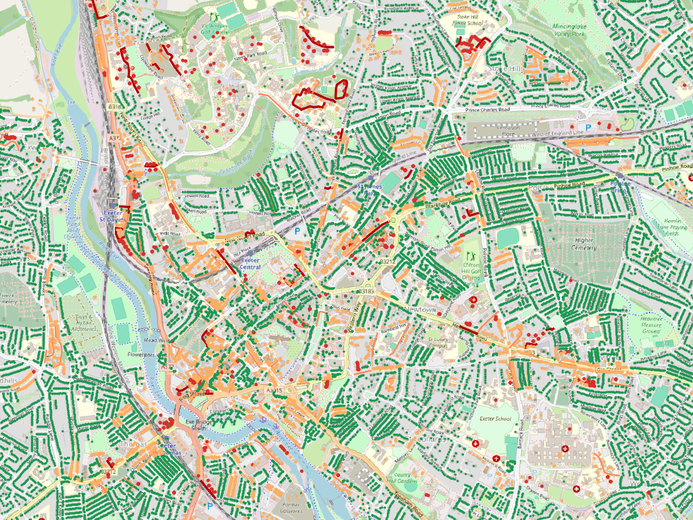

# Fibre planning pipeline: who lacks gigabit broadband, and which roads reach them

A geospatial data pipeline that turns open data into a fibre build plan for
one local authority (Exeter to start with). It combines **population per
address** (from the companion project
[GB-Census-Population-Map](https://github.com/petersolan/GB-Census-Population-Map)),
**Ofcom Connected Nations** broadband coverage by postcode, and the **OS Open
Roads** network, then ranks road links by people without gigabit service per
km of road.

> Work in progress. Done: pipeline, PostGIS and migrations; read-only API;
> GeoServer and QGIS. Next: CI, PowerShell tooling, observability, a QGIS
> plugin and packaging.



*QGIS project (`qgis/fibre_planning.qgz`): premises green with gigabit, red
without; road links from pale to dark red by people without gigabit per km.
GeoServer serves the same layers with the same SLD styles.*

## First results: Exeter (January 2026 coverage)

| | |
|---|---|
| Premises (addresses in buildings) | 73,646 |
| Residents | 130,371 |
| Gigabit coverage | 86.2% of premises |
| People without gigabit (expected) | ≈ 12,000 |
| Road links serving them | 722 of 6,402 |
| Best 20 road links | 1.9 km of road reaching ≈ 4,200 people |

## How it works

A [Kedro](https://kedro.org) project with three pipelines:

1. **ingest**: the boundary from the ONS API; the area's addresses and
   population from GeoParquet (filtered on read); Ofcom postcode CSVs from the
   zip; OS Open Roads **Shapefiles** read straight from the zip for the 100 km
   grid squares the area touches; validation that fails fast on bad data.
2. **analysis**: each address gets its postcode's chance of having no gigabit
   service; addresses snap to their nearest road link (the cable drop); road
   links are ranked by people without gigabit per km.
3. **publish**: loads PostGIS tables (schema owned by **Alembic** migrations,
   GiST spatial indexes, a read-only role for services), exports a Shapefile
   and a GeoPackage for QGIS, and records each run in `fibre.pipeline_run`.
4. **serve**: a read-only **FastAPI** service (`/v1/...` GeoJSON endpoints,
   `/health`, `/ready`, Prometheus `/metrics`), and **GeoServer**, configured
   through its REST API, publishing the PostGIS tables as WMS/WFS layers with
   SLD styles. The QGIS project connects through a PostgreSQL service name, so
   it holds no passwords.

## Running it

```powershell
conda env create -f environment.yml
conda activate fibre
copy .env.example .env          # then set passwords
docker compose up -d postgis    # PostGIS on 127.0.0.1:5433
alembic upgrade head            # create the schema and read-only role
kedro run                       # about 30 s for Exeter
docker compose up -d --build    # API on :8000, GeoServer on :8080
python -m fibre_planning.geoserver   # publish layers and styles
.\scripts\setup_pg_service.ps1  # pg_service.conf entry for QGIS
pytest
```

API docs: http://127.0.0.1:8000/docs. GeoServer: http://127.0.0.1:8080/geoserver.
Open `qgis/fibre_planning.qgz` in QGIS 3.34+.

Inputs go in `data/01_raw/` (not committed): Ofcom Connected Nations
January 2026 fixed coverage zip and the OS Open Roads GB Shapefile zip. The
census outputs are read from `../Census-distribution/data/processed`.

## Data and licences

| Data | Source | Licence |
|---|---|---|
| Fixed broadband coverage by postcode | [Ofcom Connected Nations](https://www.ofcom.org.uk/phones-and-broadband/coverage-and-speeds/connected-nations-update-spring-2026), January 2026 | OGL v3 |
| Road network | [OS Open Roads](https://www.ordnancesurvey.co.uk/products/os-open-roads) (Shapefile) | OGL v3 |
| Local authority boundary | ONS Open Geography Portal, LAD May 2025 | OGL v3 |
| Population per address | GB-Census-Population-Map (Census 2021/2022, ONSUD, OS Open Zoomstack) | OGL v3 |
