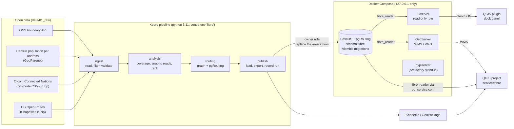

# Architecture

## Components

| Component | Code | Role |
|---|---|---|
| Pipeline | `src/fibre_planning/pipelines/` | Kedro project: `ingest`, `analysis`, `routing`, `publish` (24 nodes) |
| Routing | `src/fibre_planning/pipelines/routing/` | Road graph, pgRouting Dijkstra from the existing network, build network ([ADR 5](adr/0005-routing-from-the-existing-network.md)) |
| Custom datasets | `src/fibre_planning/datasets/` | PostGIS table (Alembic-owned schema), GDAL vector files |
| Monitoring hooks | `src/fibre_planning/hooks.py` | Node timings, row counts, memory: `logs/pipeline.jsonl` and `fibre.pipeline_run` |
| Database | `migrations/`, `src/fibre_planning/db/` | PostGIS schema, GiST indexes, constraints, read-only role |
| API | `src/fibre_planning/api/` | FastAPI `/v1`, `/health`, `/ready`, `/metrics` |
| GeoServer | `src/fibre_planning/geoserver.py`, `geoserver/styles/` | Publishes the tables over REST, SLD styles |
| QGIS | `qgis_project/`, `qgis_plugin/` | Project built with PyQGIS; plugin talking to the API |
| Tooling | `scripts/*.ps1`, `run.bat`, CI files | Task runner, packaging, pg_service setup, CI |

## Data flow and ownership

- **Alembic owns the schema.** The pipeline never creates or alters tables: it
  replaces rows inside one transaction, so indexes, constraints and grants
  survive every run and a failed load leaves the previous data in place.
- **Several areas, one run each.** Every table is keyed by `lad_code` first. A
  run plans one area (`--params area.lad_code=...`) and replaces only that
  area's rows, so Exeter and Mid Devon sit side by side
  ([ADR 6](adr/0006-several-areas-side-by-side.md)). The API, GeoServer layers
  and QGIS project show all areas; the API and the plugin can filter to one.
- **Two database roles.** `fibre_owner` migrates and loads; `fibre_reader` can
  only `SELECT` and is what the API, GeoServer and QGIS use.
- **Coordinates.** Everything is stored in British National Grid (EPSG:27700),
  the national grid that GB data and engineers use. The API converts to WGS84
  only on output, because GeoJSON requires it.

## Decisions

Recorded as ADRs in [`docs/adr/`](adr/).
